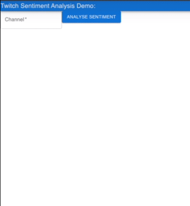

# Twitch Sentiment Webapp
This repo is a locally ran demo for our BERT+W2V model for sentiment analysis of twitch chat. The model and paper, as well as a script to infer on individual messages, are available publicly [here](https://github.com/rjunw/twitch-sentiment-model).

For usage, look into the particular directories for frontend and backend.

Once working, it should look something like this:  

